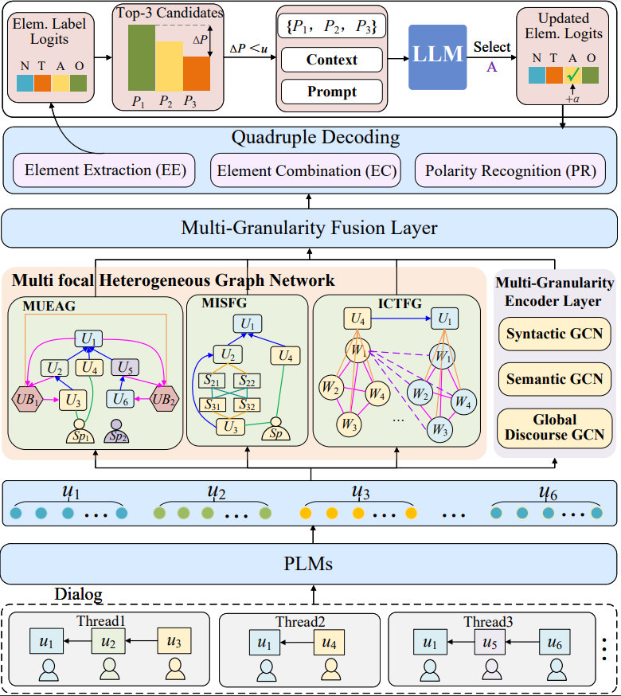

# TMHG
<a href="https://github.com/vvan0228/TMHG">
  
</a>
<a href="https://github.com/vvan0228/TMHG" rel="nofollow">
  
</a>
<a href="https://huggingface.co/docs/transformers/index" rel="nofollow">
  
</a>

This repository contains data and code for the paper: **TMHG: Threefold Multi-focal Heterogeneous Graphs for Conversational Aspect-based Sentiment Quadruple Analysis** (Under Review)[cite: 10].

------

To clone the repository, please run the following command:

```bash
git clone [https://github.com/vvan0228/TMHG.git](https://github.com/vvan0228/TMHG.git)
cd TMHG
```

## News 🎉

:loudspeaker: `2026-09-11`: Released the repository.

:zap: `2026-09-11`: Created repository.  


## Quick Links
- [Overview](#overview)
- [Requirements](#requirements)
- [Data Preparation](#data-preparation)
- [TRAIN](#train)


## Overview
In this work, we propose **TMHG** (Threefold Multi-focal Heterogeneous Graphs) for DiaASQ, which aims to extract Target-Aspect-Opinion-Sentiment quadruples from multi-turn dialogues[cite: 10]. 

TMHG models structural semantics from three complementary perspectives:
- **MUEAG**: Multi-Thread Utterance Evolution Association Graph[cite: 10]
- **MISFG**: Multi-Dimensional Intra- and Inter-Thread Sentence Focus Graph[cite: 10]
- **ICTFG**: Intra-Thread Cross-Utterance Token Focus Graph[cite: 10]

<center>

</center>


## Requirements

The model is implemented using PyTorch[cite: 17]. The versions of the main packages:

+ python >= 3.8
+ torch >= 1.9.0
+ transformers >= 4.20.1

We achieve the score reported in the paper by the following packages:
+ python                    3.8.10
+ torch                     1.9.0+cu111
+ torchaudio                0.9.0
+ torchvision               0.10.0+cu111
+ transformers              4.20.1
+ numpy                     1.21.6

Install the other required packages:
```bash
pip install -r requirements.txt
```

+ GPU memory requirements:

| Dataset | Batch size | GPU Memory |
| --- | --- | --- |
| Chinese | 2 | 12GB |
| English | 2 | 20GB |


## Data Preparation
### 1. Get Dataset
We evaluate on the benchmark **DiaASQ** dataset. Download the original dataset from [DiaASQ](https://github.com/unikcc/DiaASQ/tree/master/data/dataset) to `data/dataset`.

Then install spaCy and download the corresponding models:
- `zh_core_web_trf` for Chinese (ZH) dataset
- `en_core_web_trf` for English (EN) dataset

You can get the dependency parsed data by running:
```bash
cd ./data/dataset/
python gen_dep_dataset_by_spacy.py
```


## TRAIN
Configure paths and hyperparameters in `src/config.yaml`.

### 1. Run Script
```bash
# seed = 41-45
bash script/train.sh
```


